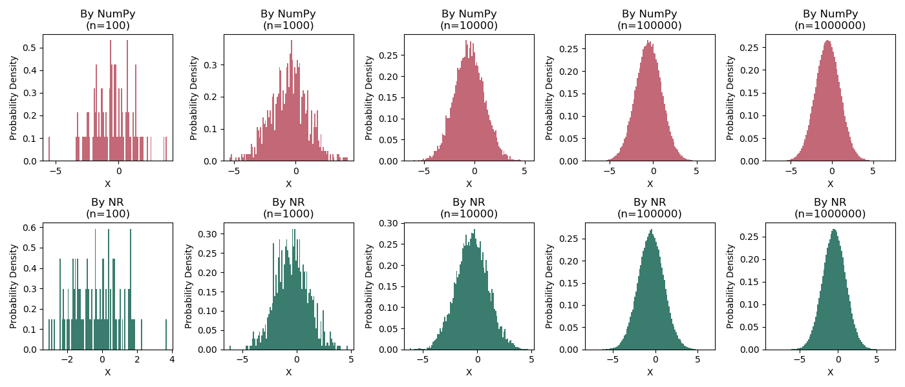

# MAT3008
**Numerical Analysis**, Fall 2019.  

- [HW #1](hw1): Obtaining Machine Epsilon
- [HW #2](hw2): Errors
- [HW #3](hw3): Root Finding
- [HW #4](hw4): Root Finding (2)
- [HW #5](hw5): Linear Equation
- [HW #6](hw6): Random Number Generation
- [HW #7](hw7): Eigenvectors and Eigenvalues
- [HW #8](hw8): Linear Interpolation
- [HW #9](hw9): Linear Data Fitting
- [HW #10](hw10): Nonlinear Data Fitting